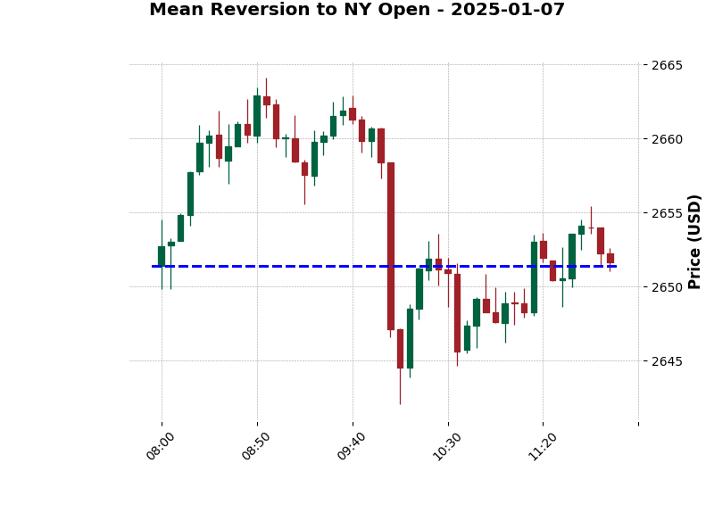

# XAUUSD (Gold) Backtesting Memory & Insights

**Backtesting Period Analyzed:** Dec 31, 2024 - Apr 24, 2026
**Timeframe:** 5-Minute Chart
**Session Focus:** NY Session (08:00 AM - 12:00 PM EST / 19:00 - 22:30 IST)

---

## Entry: 2026-04-26

## 📊 Core Chart Analysis

### Price & Growth
1. **Initial Price at Starting:** $2625.91 (on 2024-12-31)
2. **End Price:** $4707.86 (on 2026-04-24)
3. **Total Growth:** +$2081.96 (+79.29%)

### Market Drawdown & Volatility
4. **Max Drawdown:** The maximum drawdown observed across this period was **-26.33%**.
5. **NY Session Candle Volatility (5m candles):**
   - **Max:** $211.37
   - **Min:** $0.59
   - **Average:** $6.23

### Classic Judas Swing Setup
6. **Judas Swing Occurrences:** The classic setup (sweeping Asian/London extremes before reversing to close the session in the opposite direction) played out on **88 separate days**.
7. **Key Reversal Time (IST):** The most common time for a Judas Swing reversal to occur is exactly **20:00:00 IST** (8:00 PM IST / 9:30 AM EST).

---

## 🎯 Deep Insights & High-Probability Patterns (>60% Win Rate)

We analyzed the NY Session across 338 valid trading days to find patterns that occurred with extremely high frequency.

### 1. Mean Reversion to NY Open (79.59% Probability)
* **The Pattern:** Price moves at least $5 away from the 8:00 AM NY Open price, and then fully reverses to touch the opening price again before 12:00 PM.
* **Occurrences:** 269 out of 338 days.
* **Insight:** If the market runs significantly in one direction at the NY open, there is a massive ~80% chance it will retrace back to the open price before the session ends. This is a very dependable "Return to Open" mean reversion setup.
* **Detailed Breakdown:**
  * **Average Move Before Reversal:** It moves an average of **$12.32** away from the open before the reversal begins.
  * **Reversal Sharpness:** **75.09% of the time, it is a Sharp Reversal**. The price spends less than 15 minutes (under 3 candles) within a $2 range of the peak extreme before violently turning around. Only 25% of the time does it consolidate at the top/bottom.
  * **Timing (IST):** The extreme peak is most frequently hit around **18:00 to 18:45 IST**. The full reversion (touching the open price again) is usually completed very quickly, most commonly between **18:35 to 19:00 IST**.
  * **The "Fat Tail" Macro Warning (Crucial Insight):** The distribution of losing days vs winning days is completely different. 
    * **Winning Days (Reversions):** Median move is **$8.68**, and 75% of reversions happen after a move of **$14.34** or less.
    * **Losing Days (Trend Days):** Median move is a massive **$30.84**, and 25% of losing days pushed **$46.70+**.
    * **Win Rate Decay by Threshold:**
      * Move >= $5: **80% Win Rate**
      * Move >= $10: **63% Win Rate**
      * Move >= $15: **50% Win Rate**
      * Move >= $20: **43% Win Rate**
    * **Actionable Conclusion:** If the initial move extends beyond **$15-$20**, the probability of a full reversion drops below 50%. These "fat tail" moves are likely driven by genuine macro catalysts (CPI, FOMC, NFP) creating a real directional repricing. **Do not try to fade moves larger than $15 back to the open.**
  * **Macro Failure Timing Profile:** When the pattern fails (Trend Days), the move tends to ignite exactly on major NY time milestones rather than building up slowly:
    * **The $10 Breakaway:** The moment the trend officially crosses $10 away from the open happens most frequently at **18:00 IST (8:30 AM EST)** or **18:30 IST (9:00 AM EST)**.
    * **The Momentum Injection:** The largest, most explosive 5-minute candle of the entire session on failure days heavily clusters at **18:00 IST (8:30 AM EST - Economic Data)** and **19:00 IST (9:30 AM EST - NY Equities Open)**. 
    * **Insight:** If you see a violent, massive 5-minute expansion candle exactly at 18:00 IST or 19:00 IST that pushes the price $10+ away from the open, do not fade it. That is institutional money pricing in a catalyst.

### 2. London/NY Overlap Breakout Continuation (77.22% Probability)
* **The Pattern:** The first hour of the NY session (8:00 AM - 9:00 AM EST) sets an Initial Balance range. If the price breaks out of this 1-hour range after 9:00 AM, it will continue for at least $5 in the direction of the breakout.
* **Occurrences:** 261 out of 338 days.
* **Insight:** Instead of trying to fade the breakout, if price breaks the 8-9 AM high or low, you can confidently target a quick $5 scalp in the direction of the break.

### 3. 10 AM "Silver Bullet" Trend (66.57% Probability)
* **The Pattern:** Between 10:00 AM and 11:00 AM NY time, the price trends strongly in one direction, such that the 11:00 AM price is at least $5 away from the 10:00 AM price.
* **Occurrences:** 225 out of 338 days.
* **Insight:** The 10:00 AM hour is extremely volatile and highly directional. If you catch the right side of the momentum starting at 10 AM, it will comfortably deliver a $5+ move within the hour.

### 4. 10 AM Reversal / Extremes (40.83% Probability)
* **The Pattern:** The absolute High or Low of the entire NY session is formed between 9:45 AM and 10:30 AM EST.
* **Occurrences:** 138 out of 338 days.
* **Insight:** While slightly under 60%, it's incredibly significant that over 40% of the time, the *absolute extreme* for the entire session is formed in this tiny 45-minute window.

---

## Entry: 2026-04-27

## ⏱️ Early Reversal Timing Analysis

### Can the Reversal Happen 5-10 Minutes After the NY Open?

**Short Answer:** The initial displacement move happens in the first 5-10 minutes very often, but this is NOT the reversal — it is the **liquidity sweep / Judas Swing**. The true session extreme (peak before reversal) almost never forms that early.

### Early Move Frequency (First 10 Minutes)
* **201 out of 338 days (59.5%)** had a $5+ move within the first 10 minutes of the NY open.
* These early moves ranged from **$5 to $78** — the first 10 minutes are often the most violent of the session.
* **Key Distinction:** This early move is the initial displacement, NOT the session extreme. Price typically pushes even further before the real reversal kicks in.

### When Does the Session Extreme (Peak Move) Actually Form?

| Time After NY Open | Days | % of Total | Reversion Win Rate |
|---------------------|------|------------|--------------------|
| 0-5 min | 0 | 0.0% | — |
| 5-10 min | 1 | 0.3% | 0.0% |
| 10-15 min | 3 | 0.9% | 100.0% |
| 15-20 min | 0 | 0.0% | — |
| 20-30 min | 6 | 1.8% | 66.7% |
| **30-45 min** | **17** | **5.0%** | **94.1%** |
| 45-60 min | 20 | 5.9% | 70.0% |
| 60-90 min | 47 | 13.9% | 66.0% |
| 90-120 min | 41 | 12.2% | 31.7% |
| 120-180 min | 77 | 22.8% | 19.5% |
| 180-240 min | 125 | 37.1% | 0.8% |

* **Median time to extreme:** 150 minutes (2.5 hours into session)
* **25th percentile:** 85 minutes
* **75th percentile:** 205 minutes

### The "Golden Window" for Reversals
* The **30-45 minute** bucket has the **highest reversion win rate at 94.1%** (16 out of 17 days).
* The **45-90 minute** window maintains a strong **66-70% win rate**.
* After **2 hours**, the probability of reversion drops below 32% — if the extreme hasn't formed by then, it's likely a trend day.
* **Actionable Rule:** The optimal window to watch for the extreme forming is **30-90 minutes after the NY open** (18:30 - 19:30 IST / 8:30 - 9:30 AM EST).

### How Fast Does the Reversal Complete?
Once the extreme forms and the reversal begins, it can be extremely fast:
* **Fastest full reversion (extreme → back to open):** 5 minutes
* **23.7%** of reversions completed within 15 minutes of the extreme
* **8.2%** completed within 10 minutes
* **Median reversal speed:** 40 minutes from extreme to touching the open price again
* **Mean reversal speed:** 49 minutes

### Summary
1. The first 5-10 minutes create the **displacement/sweep** (59.5% of days have a $5+ early move).
2. The **true session extreme** almost never forms that early — it typically forms 30-150 minutes in.
3. The **sweet spot** for catching a reversal is when the extreme forms at **30-90 minutes** (highest win rates).
4. Once the reversal starts, **~24% complete within 15 minutes** — so yes, the reversal itself can be very sharp and fast.
